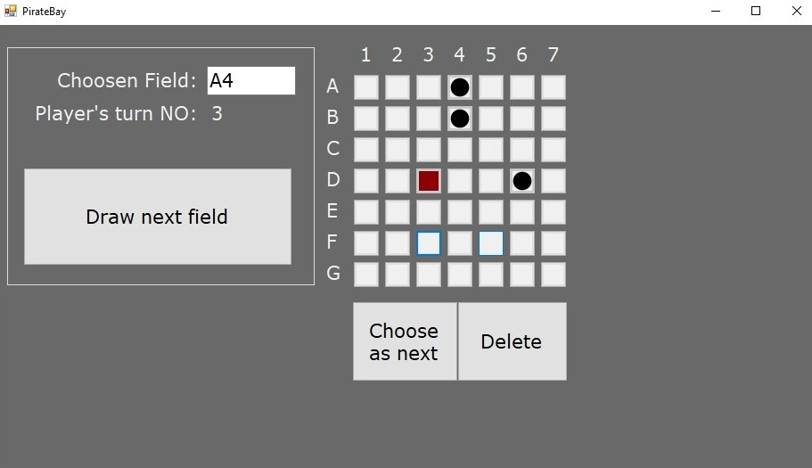

# PirateGame_winForms
  
<article>
	This simple random field generator was created to improve pen and paper game version by choosing the field and unify fields' map.
	full game description available at:	
</article>
 
https://www.tes.com/teaching-resource/the-pirate-game-end-of-term-activity-6258063
  

